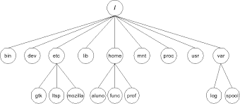

### Introdução

Tudo começou com um jovem de 21 anos chamado **Linus Benedict Torvalds** que em 25 de Agosto de 1991 apreesentou a primeira versão do Linux, a 0.01, mais tarde vieram mais 3 versões 94(v1.0), 96(v2.0), 2001(v3.0), 2015(v4.0)  
A primeira coisa a saber é que o Linux não é um sistema operacional e sim um nucleo que faz a ponte entre as distribuições (linguagens de alto nivel) com a linguagem de baixo nível (linguagem de máquinas.  


### Debian GNU/Linux
[](https://www.debian.org/ "Comunidade Debian" ) 


O Debian é uma das distribuições mais tradicionais, anunciado em 1993 pelo Ian Murdock, e desde 94 é distribuido no espirto GNU (sistema de softwares livres), em 1996 veio sua primeira versão estável.  
Um dos motivos do Debian ser uma das principais distribuições linux é seu gerenciamento de pacotes conhecido como APT (Advanced Packet tool), cada aplicação do Debian ode ser facilmente instalada no sistema por meio do APT.


### Ubunto Server
[](https://ubuntu.com/)

O Ubunto hoje em dia é a distribuição mais usada em desktops, tem uma etratégia agressiva de lançar uma atualização a cada 6 meses, isso acaba deixando um pouco instável, porém, para contirnar este problema, a cada 2 anos é lançada uma versão TLS com suporte de longa duração(5anos), tem suporte da Canonical, uma empresa com fins lucrativos.  
Devido ao supprte a serviços de infraestrutura como (IaaS), E comum que empresas queiram contratos que garantam o funcionamento ininterrupto do sistema, e neste quesito, o Debin não consegue prover.

### Revisão de comandos basicos  

```
sysadmin@Linux:~$ mkdir teste
sysadmin@Linux:~$ touch ./teste/arquivo1.txt ./teste/arquivo2.txt 
sysadmin@Linux:~$ cd teste 
sysadmin@Linux:~/teste$ le -l
total 0
-rw-rw-r-- 1 sysadmin sysadmin 0 Mai 11 14:53 arquivo1.txt
-rw-rw-r-- 1 sysadmin sysadmin 0 Mai 11 14:53 arquivo2.txt
sysadmin@Linux:~/teste$ rm arquivo1.txt
sysadmin@Linux:~/teste$ ls -l
total 0 
-rw-rw-r-- 1 sysadmin sysadmin 0 Mai 11 14:53 arquivo2.tx
sysadmin@Linux:~/teste$ cd ..
sysadmin@Linux:~$ rm -rf ./teste 
sysadmin@Linux:~$ nano script.sh
(...) Executa o edutor de texto NANO
(...) crtl+X para sair 
sysadmin@Linux:~$ chmod +x ./script.sh 
sysadmin@Linux:~$ ls -l 
total 0
-rwxrwxr-x 1 sysadmin sysadmin 0 Mai 11 14:53 script.sh 
sysadmin@Linux:~$ ./script.sh
(...) Executa o script 
```
### Estrutura de diretórios do Linux

Assim como no Unix, no linux, os discos e partições ficam ocultas tendo o usuário apenas acesso a visão logica  da árvore de diretório do Linux.  
Apenas administradores tem uma série de ferramentas para visualizar os discos como por exemplo o comando **fdisk** ou a tabela de partições que fica rm **/etc/fstab**  
**FHS** é um padrão seguido pela comunidade Linux que orienta como os diretórios basicos devem ser nomeados e organizados, não para engessar o desenvolvedor e sim para facilitar a localização de arquivos na estrutura  
A arvore do Linux tem um ponto principal que é representado pelo "/", ou seja, é pasta principal do sistema, todos os outros diretórios são subdiretõrios    

  

Uma boa pratica, é deixar pelomenos as partições /home (pasta doos usuarios e /var (arquivos de log do sistema) fiquem em uma partição a parte para evitar que quando cheios, não comprometer o funcionamento do sistema.  
A tabela a baixo, mostra os diretórios que devem existir a partir da raiz do linux.  

|Diretórios| Descrição|Observaçãso|
|---|---|---|
|/bin|Binários essenciais de programas/comandos||
|/boot|Arquivos estáticos de carregador de boot||
|/dev|Arquivos que representam dispositivos fisicos||
|/etc|Arquivos de configuração do sistema||
|/home|Pasta dos usuários|Opcional|
|/lib|Modulos do kernel e bibliotecas compartilhadas||
|/media|Ponto de montagem de mídia removíveis||
|/mnt|Ponto de montagem de sistema de arquivos temporários||
|/opt|Pacotes de softwares adiciionados||
|/proc|Informações de processos do kernel||
|/root|Pasta do superusuário root|Opcional|
|/sbin|Bináruos essenciais dos sistema||
|/srv|Dados providos pelo servidor||
|/tmp|Arquivos temporários||
|/usr|Hierarquia secundária||
|/var|Dados variáveis (logs)||

### Navegação de arvore de diretórios

Para a navegação no Linux, usa-se o comando **cd** , ex: ` ~$ cd nome_do_diretório ` nete caso estamos usando um caminho relativo, parte do diretório atual que o usuário está, é considerado caminho completo todo aquele que começa a partir da rais **/**.   
Existe um caminho para sabermos em qual diretório estamos, é o comando **pmd**.   
Também tem os atalhos como **~** que leva direto ao diretório do usuário ou o **/** que leva direto ao diretório raiz, ou seja, o **~** para o usuário fulano, subistituie o **/home/fulano.**  
O comando **"."** (ponto) faz referencia ao diretório atual e o comando **".."** (2 pontos) faz referência a um nível superior.

Usando o comando **ls -l** com o caminha absoluto
```
root@Linux:/# ls -l /etc/dhcp
total 28
(...)
-rw-w--w-- 1 root 1735 Jan 16 2017 dhclient.conf 
-rw-w--w-- 1 root 3331 Jan 19 2017 dhcpd6.conf 
-rw-w--w-- 1 root 3496 Jan 19 2017 dhspd.conf 
```
Usando o comando **ls -l** com o camilho relativo a partir da posição corrente com e sem o **"."**.
```
root@Linux:/# cd etc 
root@Linux:/etc ls -l ./dhcp/
total 28
(...)
-rw-r--r-- 1 root root 1735 Jan 16 2017 dhclient.conf
-rw-r--r-- 1 root root 3331 Jan 19 2017 dhcpd6.conf
-rw-r--r-- 1 root root 3496 Jan 19 2017 dhspd.conf
``` 
```
root@Linux:/# cd etc 
root@Linux:/etc ls -l dhcp/
total 28
(...)
-rw-r--r-- 1 root root 1735 Jan 16 2017 dhclient.conf
-rw-r--r-- 1 root root 3331 Jan 19 2017 dhcpd6.conf
-rw-r--r-- 1 root root 3496 Jan 19 2017 dhspd.conf
```

### Manipulação de arquivos e diretórios

Para a manipulação de arquivos, são utilizados os seguintes comandos:

|Comando|Ação|
|:---:|---|
|touch|cria um arquivo vazio|
|cat|consulta um arquivo|
|cp|copia um arquivo|
|mv|move ou renomeia uma rquivo|
|rm|remove um arquivo|
|mkdir|cria um diretório|
|rmdir|remove diretorio(vazio)|

Um arquivo também é criado automaticamente quando tentamos executa-lo com um editor de texto ex: `~$ vi arquivo.txt` automaticamente o **arquivo.txt** será criado no local em que o comando foi executado.  
Os editores de texto mais comuns no Linux são: vi, vim, nano e mcedit sendo que os dois ultimos são os mais amigaveis para aprender a mexe, e os dois primeiros os mais usados pelos administradores por praticas antigas e por muitas vezes serem a unica opção em um servidor linux.  
**Resumo das teclas e comandos no vi/vim**
|Tecla/comando|Ação|
|:-:|-|
|A|Inserir texto no final da linha|
|dd|Remover uma linha inteira (e colocar na memoria)|
|i|Entrar em modo de edição na posição atual do cursor|
|I|Insere texto no inicio da linha|
|o|Adiciona linha abaixo do cursos atual|
|O|Adicionar linha acima do cursor atual|
|p|Colar conteúdo da memoria no texto|
|r|Substituir um único caractere|
|s|Substituir texto na atual posição do cursor|
|u|desfaze a ultima ação executada|
|x|Apagar um unico caractere|
|y|Copiar um item na memoria|
|yy|Copiar uma linha inteira na memoria|
|:!|Permite executar um comando do shell|
|:q|Sair do aplicativo|
|:q!|Sair do aplicatidvo sem salvar as alterações|
|:wq|Sair do aplicatidvo e salvar as alterações|
|:w|Salva as alteraçoes do arquivo sem sair|

Outro comando bem util é o **ln -s**, que cria um link simbólico (atalho) para um arquivo que esteja em outro diretório, por exemplo:  
Este comando vai criar um link simbólic (atalho) no diretório home para o arquivo **texto.txt** que está no diretório root 
`[root@localhost home]# ln -s /root/texto.txt /home/`
OBS.: O link simbólico não precisa ter o memso nome do arquivo original

### Permissões em arquivos e diretórios

